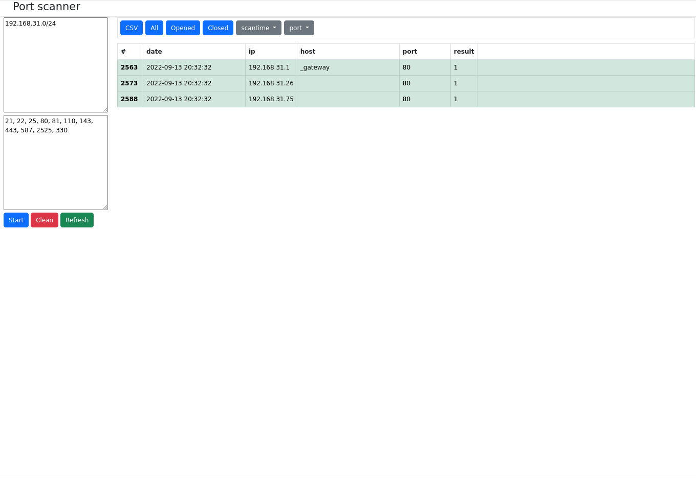

# wapp_network_scanner

Веб-приложение для сканирования портов. 
Зависимости (библиотеки) включены в репо.

## Зависимости

- php 7
- sqlite
- redbeansphp
- spatie/fork" ^1.1 
- markrogoyski/ipv4-subnet-calculator ^4.0

